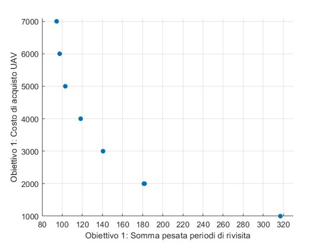
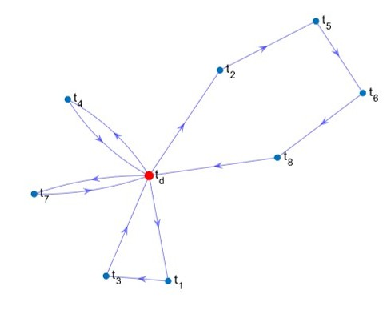
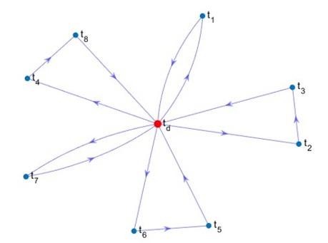
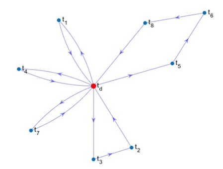
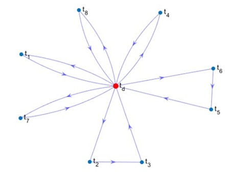

# Multi-objective UAV routing in persistent Intelligence, Surveillance and Reconnaissance (PISR) missions under uncertainty


The project formulates a persistent multi-UAV routing problem as a **Mixed-Integer Linear Programming (MILP)** model. The objective is to assign task-visiting cycles to UAVs while balancing two conflicting requirements:

1. reducing the revisit period of high-priority tasks;
2. limiting the acquisition cost of the UAV fleet.

A scenario-based robust counterpart is also implemented to handle uncertainty in task-priority weights across optimistic, medium and pessimistic operating conditions.

---

Persistent ISR missions require UAVs to periodically visit a set of spatially distributed task locations and return collected information to a control station. In this project, the mission is planned before execution: each UAV is assigned a cyclic route that is repeated over time.

The routing problem is modeled on a directed graph and solved as a MILP. The model includes assignment constraints, depot flow constraints, self-loop prevention, Big-M subtour elimination constraints, revisit-period constraints and fleet-size bounds. A multi-objective formulation is first analyzed through a Pareto-front exploration. Then, an aggregated objective is used to combine monitoring performance and UAV acquisition cost. Finally, a robust optimization model is introduced to protect the solution against uncertainty in task-priority weights.

---

## 2. Problem statement

The mission environment is represented as a graph:

- `t_d` is the depot/control station;
- `T = {t_1, ..., t_8}` is the set of monitored task locations;
- `V = T ∪ {t_d}` is the set of all nodes;
- `E` is the set of directed arcs connecting pairs of nodes;
- `c_ij` is the travel time from node `i` to node `j`.

The planning problem determines:

- how many UAVs should be acquired;
- which arcs should be assigned to the UAV fleet;
- which cyclic task sequence each UAV should repeatedly execute;
- how long each task waits before being revisited.

The engineering trade-off is direct: increasing the number of UAVs can improve monitoring frequency, but it increases fleet acquisition cost.

---

## 3. Metrics and decision criteria

### Delivery time

For a task `t_i`, the **delivery time** is the time elapsed from task completion until the UAV returns to the control station. If other tasks are visited before returning to the depot, their travel contribution is included.

In the formulation, the return-related decision variable is:

```math
v_i
```

where `v_i` models the return or delivery time from task `t_i` to the control station.

### Revisit period

For a task `t_i`, the **revisit period** is:

```math
R_i
```

It is the time interval between two consecutive visits to the same task. Because the mission plan is cyclic, `R_i` is constant for repeated visits of task `t_i`.

A smaller `R_i` means that task `t_i` is monitored more frequently.

### Weighted revisit objective

Each task has a priority weight `w_i`. The weighted revisit objective is:

```math
\sum_{i \in T} w_i R_i
```

This metric penalizes long revisit periods more strongly for high-priority tasks.

### Fleet acquisition cost

If `d` is the number of purchased UAVs and `p` is the acquisition cost of a single UAV, the fleet cost is:

```math
p \cdot d
```

### Robust worst-case objective

In the robust formulation, task weights vary across scenarios. Given the scenario set:

```math
S = \{o, m, p\}
```

where `o`, `m` and `p` denote optimistic, medium and pessimistic scenarios, the robust weighted revisit objective is:

```math
\max_{s \in S} \sum_{i \in T} w_i^s R_i
```

The robust model introduces an auxiliary variable `y` such that:

```math
y \geq \sum_{i \in T} w_i^s R_i, \quad \forall s \in S
```

and minimizes `y` inside the aggregated objective.

---

## 4. Mathematical formulation

### Decision variables

| Variable | Type | Meaning |
|---|---|---|
| `x_ij` | binary | 1 if directed arc `(i,j)` is selected by the routing solution, 0 otherwise |
| `d` | integer | number of UAVs purchased |
| `u_i` | continuous | travel time from the control station to task `t_i` |
| `v_i` | continuous | return/delivery time from task `t_i` to the control station |
| `R_i` | continuous | revisit period of task `t_i` |
| `y` | continuous | robust auxiliary variable for worst-case weighted revisit cost |

### Main objective components

The first objective minimizes the weighted sum of revisit periods:

```math
z_1 = \sum_{i \in T} w_i R_i
```

The second objective minimizes fleet acquisition cost:

```math
z_2 = p \cdot d
```

After Pareto-front analysis, the objectives are combined through an aggregated objective:

```math
\min z = 0.75 \sum_{i \in T} w_i R_i + 0.25 p d
```

For the robust model, the weighted revisit component is replaced by `y`:

```math
\min z = 0.75 y + 0.25 p d
```

### Constraint families

The implemented MILP includes the following constraint families.

| Constraint family | Engineering role |
|---|---|
| Degree constraints | Ensure that each task has exactly one selected incoming and one selected outgoing arc |
| Depot flow constraints | Limit the number of routes departing from and returning to the control station according to the number of purchased UAVs |
| Diagonal constraints | Prevent self-loops such as assigning a task to itself |
| Subtour elimination constraints | Prevent cycles of tasks disconnected from the control station |
| Lower-bound constraints | Enforce minimum travel time from/to the control station |
| Upper-bound constraints | Link travel times to revisit periods |
| Revisit-period constraints | Ensure that the revisit period is at least the sum of outbound and return contributions |
| Fleet bounds | Impose at least one UAV and no more than the maximum purchasable number |
| Robust uncertainty constraints | Linearize the worst-case weighted revisit objective across scenarios |

---

## 5. Multi-objective optimization and Pareto-front analysis

Before adopting the aggregated objective, the project evaluates the trade-off between:

- weighted revisit objective;
- UAV acquisition cost.

The Pareto front was obtained using MATLAB `gamultiobj`. The resulting front shows the expected trade-off: fewer UAVs reduce cost but generally worsen revisit performance, while additional UAVs improve monitoring frequency at a higher fleet cost.

<p align="center">
  
</p>

<p align="center">
  <em>Figure 1. Pareto-front analysis between weighted revisit objective and UAV acquisition cost.</em>
</p>

The observed Pareto structure motivates the use of a linear aggregated objective in the scenario-specific MILP experiments.

---

## 6. Robust optimization under uncertainty

The project considers uncertainty in the priority weights of selected critical tasks. Three scenarios are evaluated:

- optimistic;
- medium;
- pessimistic.

The robust model follows an **absolute robustness** criterion: it minimizes the worst objective value across all considered scenarios. This makes the solution more conservative, but improves protection against adverse priority-weight realizations.

The robust counterpart is built by replacing the uncertain weighted revisit term with the auxiliary variable `y`, constrained to dominate the scenario-specific weighted revisit cost for every scenario.

---

## 7. Problem instance

The numerical instance contains:

- 8 task nodes;
- 1 depot/control station;
- 9 total nodes;
- 81 possible directed arcs;
- maximum number of purchasable UAVs: 7;
- UAV unit acquisition cost: 1000;
- travel times expressed in hours.

### Travel-time matrix

| From / to | `t_d` | `t_1` | `t_2` | `t_3` | `t_4` | `t_5` | `t_6` | `t_7` | `t_8` |
|---|---:|---:|---:|---:|---:|---:|---:|---:|---:|
| `t_d` | 0 | 32 | 17 | 9 | 92 | 52 | 88 | 53 | 28 |
| `t_1` | 32 | 0 | 49 | 27 | 55 | 88 | 73 | 95 | 98 |
| `t_2` | 17 | 49 | 0 | 19 | 95 | 21 | 42 | 88 | 46 |
| `t_3` | 9 | 27 | 19 | 0 | 75 | 46 | 97 | 52 | 93 |
| `t_4` | 92 | 55 | 95 | 75 | 0 | 52 | 61 | 75 | 29 |
| `t_5` | 52 | 88 | 21 | 46 | 52 | 0 | 1 | 56 | 85 |
| `t_6` | 88 | 73 | 42 | 97 | 61 | 1 | 0 | 74 | 60 |
| `t_7` | 53 | 95 | 88 | 52 | 75 | 56 | 74 | 0 | 87 |
| `t_8` | 28 | 98 | 46 | 93 | 29 | 85 | 60 | 87 | 0 |

### Scenario weights

The uncertain task-priority weights are:

| Scenario | `t_1` | `t_2` | `t_3` | `t_4` | `t_5` | `t_6` | `t_7` | `t_8` |
|---|---:|---:|---:|---:|---:|---:|---:|---:|
| Optimistic | 0.37 | 0.54 | 0.50 | 0.22 | 0.95 | 0.31 | 0.46 | 0.75 |
| Medium | 0.57 | 0.54 | 0.50 | 0.42 | 0.95 | 0.31 | 0.66 | 0.75 |
| Pessimistic | 0.77 | 0.54 | 0.50 | 0.62 | 0.95 | 0.31 | 0.86 | 0.75 |

Tasks `t_1`, `t_4` and `t_7` are the most affected by the scenario uncertainty.

---

## 8. MATLAB implementation

The implementation is organized into independent MATLAB experiment folders.

| Folder | Description |
|---|---|
| `src/pareto-front/` | Pareto-front exploration using `gamultiobj` |
| `src/scenarios/optimistic/` | MILP solution for the optimistic scenario |
| `src/scenarios/medium/` | MILP solution for the medium scenario |
| `src/scenarios/pessimistic/` | MILP solution for the pessimistic scenario |
| `src/robust-optimization/` | Absolute robust optimization model across all scenarios |

Each folder contains:

- `main.m`, which defines the instance and calls the optimization routine;
- `vincoli/`, a set of MATLAB scripts that build the equality and inequality constraint matrices.

The original Italian folder name `vincoli` has been preserved to avoid breaking the MATLAB dependencies.

---

## 9. Results

### Summary of objective-level results

| Model / scenario | UAVs purchased | Acquisition cost | Weighted revisit objective |
|---|---:|---:|---:|
| Optimistic | 4 | 4000 | 504.510 h |
| Medium | 5 | 5000 | 456.29 h |
| Pessimistic | 5 | 5000 | 456.29 h |
| Absolute robust model | 6 | 6000 | 531.83 h |

The optimistic scenario requires fewer UAVs because the uncertain task priorities are less severe. The medium and pessimistic scenarios both select 5 UAVs. The robust model selects 6 UAVs, increasing acquisition cost but providing a solution designed against the worst-case weighted-priority configuration.

### Revisit-period comparison

| Scenario | `R_1` | `R_2` | `R_3` | `R_4` | `R_5` | `R_6` | `R_7` | `R_8` |
|---|---:|---:|---:|---:|---:|---:|---:|---:|
| Optimistic | 68 | 127 | 68 | 184 | 141 | 176 | 106 | 176 |
| Medium | 64 | 45 | 45 | 184 | 141 | 176 | 106 | 149 |
| Pessimistic | 64 | 45 | 45 | 184 | 141 | 176 | 106 | 176 |
| Absolute robust model | 64 | 45 | 45 | 184 | 141 | 176 | 106 | 56 |

The revisit-period table highlights how the robust formulation changes the allocation. In particular, the robust model keeps the revisit periods of the critical tasks stable while reducing `R_8`, at the cost of purchasing one additional UAV.

---

## 10. Routing solutions

### Optimistic scenario

<p align="center">
  
</p>

<p align="center">
  <em>Figure 2. UAV route configuration for the optimistic scenario.</em>
</p>

The optimistic case purchases 4 UAVs. This is the lowest-cost scenario but produces a higher weighted revisit objective than the medium and pessimistic single-scenario solutions.

### Medium scenario

<p align="center">
  
</p>

<p align="center">
  <em>Figure 3. UAV route configuration for the medium scenario.</em>
</p>

The medium scenario purchases 5 UAVs and obtains a weighted revisit objective of 456.29 h.

### Pessimistic scenario

<p align="center">
  
</p>

<p align="center">
  <em>Figure 4. UAV route configuration for the pessimistic scenario.</em>
</p>

The pessimistic scenario also purchases 5 UAVs. The solution reflects the increased priority of the uncertain tasks while keeping the same total acquisition cost as the medium scenario.

### Absolute robust model

<p align="center">
  
</p>

<p align="center">
  <em>Figure 5. UAV route configuration for the absolute robust optimization model.</em>
</p>

The robust model purchases 6 UAVs. This is the most conservative solution: it increases acquisition cost from 5000 to 6000 relative to the medium/pessimistic scenarios, but it is optimized to remain protected against the worst-case priority-weight scenario.

---

## 11. Discussion

The results show a clear cost-performance trade-off:

- reducing the UAV count lowers acquisition cost but can increase revisit periods;
- increasing the UAV count improves the ability to serve critical tasks more frequently;
- robust optimization shifts the solution toward a more conservative allocation;
- uncertainty in task priorities can change the preferred route structure even when the travel-time matrix is fixed.

From an engineering perspective, the robust model is preferable when mission planners require a route plan that remains effective under adverse priority-weight realizations. The price of robustness is explicit: one additional UAV is purchased relative to the medium and pessimistic deterministic scenarios.

---

## 12. Repository structure

```text
uav-routing-robust-milp/
├── assets/
│   ├── pareto_front.png
│   ├── routes_optimistic.png
│   ├── routes_medium.png
│   ├── routes_pessimistic.png
│   └── routes_robust.png
├── reports/
│   └── Relazione progetto Michele Abbaticchio - Ottimizzazione Multi-Obiettivo per il Routing di UAV in Missioni PISR con Incertezza.pdf
├── src/
│   ├── pareto-front/
│   ├── robust-optimization/
│   └── scenarios/
│       ├── optimistic/
│       ├── medium/
│       └── pessimistic/
├── results/
├── README.md
└── .gitignore
```

---

## 13. Requirements

The code was developed in MATLAB.

Expected MATLAB components:

- MATLAB;
- Optimization Toolbox, for MILP solution with `intlinprog`;
- Global Optimization Toolbox, for Pareto-front exploration with `gamultiobj`.

---

## 14. How to run

Run a scenario from MATLAB by entering the corresponding folder and executing `main.m`.

Example:

```matlab
cd src/scenarios/medium
run main.m
```

For the robust model:

```matlab
cd src/robust-optimization
run main.m
```

For the Pareto-front experiment:

```matlab
cd src/pareto-front
run main.m
```

---

## 15. Documentation

The full academic report is available in:

- [Project report PDF](reports/Relazione%20progetto%20Michele%20Abbaticchio%20-%20Ottimizzazione%20Multi-Obiettivo%20per%20il%20Routing%20di%20UAV%20in%20Missioni%20PISR%20con%20Incertezza.pdf)
---

## 16. Future work

Possible extensions include:

- modeling uncertainty directly on travel times `c_ij`;
- extending the robust formulation to stochastic programming;
- introducing two-stage recourse decisions;
- evaluating larger task sets;
- comparing MILP solutions with metaheuristic or decomposition-based approaches;
- adding automatic generation of plots and result tables from MATLAB outputs.

---

## Author

Michele Abbaticchio  
MSc Automation Engineering  
Politecnico di Bari


